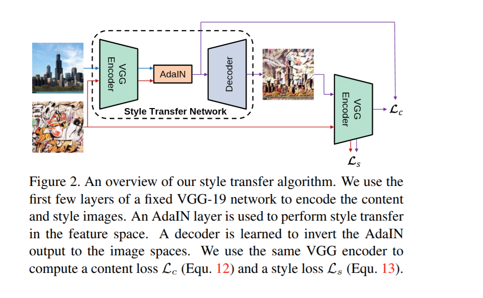

# 🎨 Neural Style Transfer (AdaIN)

A deep learning web app that transforms any photo into a work of art by applying the style of another image. It uses **Adaptive Instance Normalization (AdaIN)** with a VGG encoder to perform fast, arbitrary style transfer.

---

## 🧠 How It Works

The model follows the AdaIN approach from the paper *"Arbitrary Style Transfer in Real-time with Adaptive Instance Normalization"* (Huang & Belongie, 2017):

1. **Encoder:** A pre-trained, normalised VGG network extracts feature maps from both the content and style images.
2. **AdaIN layer:** Aligns the channel-wise mean and variance of the content features to match those of the style features.
3. **Decoder:** Reconstructs the stylized image from the adjusted features.



Because the style is injected through feature statistics, one trained model can apply **any** style image, including ones it has never seen, in a single forward pass.

---

## ✨ Features

- 🖌️ Arbitrary style transfer: use any image as the style
- ⚡ Fast inference with a single forward pass
- 🌐 Simple web interface to upload images and view results
- 🏋️ Training script included to train the decoder yourself
- 🔬 Experiment results stored for comparison

---

## 🛠️ Tech Stack

| Category        | Technologies                          |
| --------------- | ------------------------------------- |
| Deep Learning   | PyTorch, torchvision, VGG-19          |
| Web App         | Flask, HTML, CSS, Jinja templates     |
| Image Handling  | Pillow, NumPy                         |
| Language        | Python                                |

> Confirm exact libraries against your `requirements.txt`.

---

## 📁 Project Structure

```
neural-style-transfer/
├── content_data/        # Content images used for training
├── style_data/          # Style images used for training
├── examples/            # Sample inputs and outputs
├── experiment/final_exp # Saved experiment results
├── static/uploads/      # User-uploaded images (web app)
├── templates/           # HTML templates
├── utils/               # Helper functions and model code
├── app.py               # Web app entry point
├── train.py             # Training script
├── vgg_normalised.pth   # Pre-trained VGG encoder weights
├── adain_algo.png       # AdaIN architecture diagram
├── requirements.txt     # Python dependencies
└── runtime.txt          # Python runtime for deployment
```

---

## 🚀 Getting Started

### Prerequisites

- Python (see `.python-version` for the exact version)
- pip
- A GPU is optional for running the app but recommended for training

### Installation

```bash
# 1. Clone the repository
git clone https://github.com/KaranKumar7646/neural-style-transfer.git
cd neural-style-transfer

# 2. (Recommended) Create a virtual environment
python -m venv venv

# On Windows
venv\Scripts\activate
# On macOS/Linux
source venv/bin/activate

# 3. Install dependencies
pip install -r requirements.txt
```

### Run the web app

```bash
python app.py
```

Open the local URL printed in your terminal (usually `http://127.0.0.1:5000`), upload a content image and a style image, and generate your result.

---

## 🏋️ Training

To train the decoder on your own data:

1. Put content images in `content_data/` and style images in `style_data/`.
2. Make sure `vgg_normalised.pth` is in the project root.
3. Run:

```bash
python train.py
```

Trained weights and results are saved by the training script. Check `train.py` for adjustable settings such as epochs, batch size, learning rate, and style weight.

---

## ☁️ Deployment

The repo includes `runtime.txt` and `requirements.txt`, so it can be deployed on platforms like [Render](https://render.com/) or [Hugging Face Spaces](https://huggingface.co/spaces).

Note: PyTorch models need a decent amount of memory. If you use a free tier, resize uploaded images to a smaller size before processing to avoid timeouts.

---

## 📚 Reference

- Huang, X. & Belongie, S. (2017). *Arbitrary Style Transfer in Real-time with Adaptive Instance Normalization.* ICCV.

---

## 🔮 Future Improvements

- Style strength slider (alpha blending between content and stylized output)
- Preset style gallery
- Video style transfer
- Higher resolution output

---

## 🤝 Contributing

Contributions are welcome!

1. Fork the repo
2. Create a branch: `git checkout -b feature/your-feature`
3. Commit your changes: `git commit -m "Add your feature"`
4. Push: `git push origin feature/your-feature`
5. Open a Pull Request

---

## 📬 Contact

**Karan Kumar**

- GitHub: [@KaranKumar7646](https://github.com/KaranKumar7646)
- LinkedIn: [Karan Kumar](https://www.linkedin.com/in/karan-kumar-687854282/)
- LeetCode: [KaranKumar7646](https://leetcode.com/KaranKumar7646)
- Email: itskaran7646@gmail.com

---

⭐ If you found this project interesting, please give it a star!
